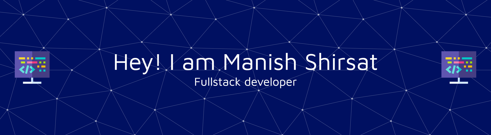

# Hi, I'm Manish Shirsat👋

## 🛠️ Technologies & Tools
### Frontend

  
  
  
  
  

### Backend

  
  
  
  
  
  

### ORM & Database

  
  
  
  

### Cloud & DevOps

  
  
  

### Scripting & Automation

  

<!-- -->

  <h4>🏆 Github Profile Trophy</h4>
  

## 📊 GitHub Stats

## 🏆 Top Languages

## 🔥 GitHub Streak

<!-- ## 🏆 GitHub Trophies
 -->

